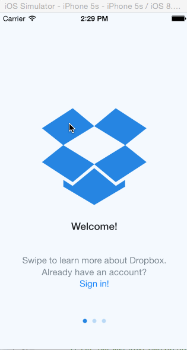

# HW1CodePath
Homework 1 CodePath: Dropbox Project

This is an iOS demo that creates an example app that uses XCode and Swift to create simple flows between different screens based on an example app (Dropbox).  I utilized the example step by step Tutorials in the [CodePath Week 1 Project Folder] (http://courses.codepath.com/courses/ios_for_designers/unit/1#!assignment) to create this app.  

Time spent: ~8 hours developing + ~1 hour of video watching time

Completed user stories:
* [x] Required: User can tap through the 3 welcome screens.
* [x] Required: User can follow the create user flow.
  * On the create user form, the user can tap the back button to go to the page where they can sign in or create an account.
  * Before creating the account, user can choose to read the terms of service.
  * After creating the account, user can view the placeholders for Files, Photos, and Favorites as well as the Settings screen.
  * User can log out from a scrollable Settings screen.
* [x] Required: User can follow the sign in flow.
  * User can tap the area for "Having trouble signing in?"
  * User can log out from the Settings screen.
* [x] Optional: User can view one of the files and click a button which changes states to favorite it (won't actually favorite the file though)
* [x] Optional: user can type into the text field in the Sign In Flow.  UI Elements will dynamically move with the keyboard and the user can dismiss the keyboard.
* [x] Optional: User can swipe through the welcome screens instead of just tapping them.

GIF created with [LiceCap](http://www.cockos.com/licecap/).
